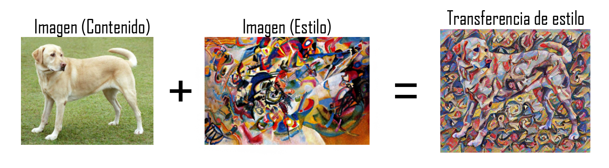
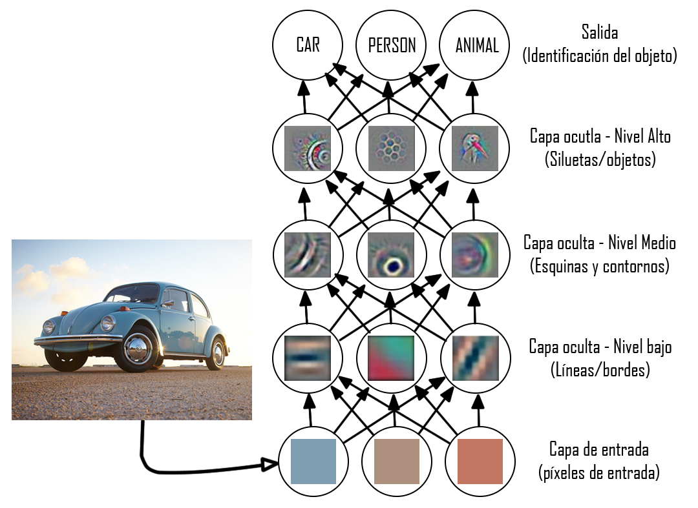

# Transferencia de estilo
En este mini proyecto podrás encontrar el código en python **Vision_17_StyleTransfer**, el cual tiene como objetivo aplicar el estilo de una imagen a otra. Es decir, se busca fusionar el contenido de una imagen con el estilo de otra (Imagen 1)

|  | 
|:--:| 
| *Imagen 1: Transferencia de estilo* |

Un ejemplo de lo que se quiere lograr lo podemos encontrar en aplicación para Android [Lucid](https://play.google.com/store/apps/details?id=com.doodle.doodle)

En este código se podrá encontrar dos formas de obtener la transferencia de estilo: el primer método es entrenar una red neuronal pre-entrenada; el segundo método es utilizando una red neuronal entrenada del repositorio TensorFlow Hub.

# Tabla de contenido

- [Teoría detrás del código](#Teoría-detrás-del-código)
- [Preparaciones iniciales]()
  * [Abrir el código en un IDE]()
  * [Cargar las librerías necesarias]()
  * [Cargar imagen contenido e imagen estilo]()
- [Primer método de transferencia de estilo: terminar de entrenar una red neuronal](#requerimientos-del-sistema)
- [Segundo método de transferencia de estilo: red neuronal de TensorFlow Hub](#requerimientos-del-sistema)

# Teoría detrás del código
Las redes neuronales convolucionales (CNN) son redes neuronales con aprendizaje supervisado que realiza su procesamiento a través de diversas capas. Estas capas están divididas en: capa de entrada, capas ocultas y capa de salida. 

Dentro de las capas intermedias existe una jerarquía (Imagen 2):
- Las capas ocultas de nivel bajo detectan bordes
- Las capas ocultas de nivel medio detectan esquinas y contornos.
- Las capas ocultas de nivel alto detectan partes de objetos o formas complejas. 

En general, se dice que las capas ocultas se van especializando conforme se van acercando a la capa de salida, pues pasan de detectar simples líneas a detectar siluetas de rostros, objetos o animales. 

|  | 
|:--:| 
| *Imagen 2: Jerarquía de capas ocultas (filtros)* |

Tomando en cuenta la jerarquía anterior, se ha demostrado que los filtros formados en las capas ocultas que se encuentran a partir de la mitad contienen el estilo de la imagen. Por lo tanto, son estas capas las que se utilizan para entrenar la red de transferencia de estilo.
